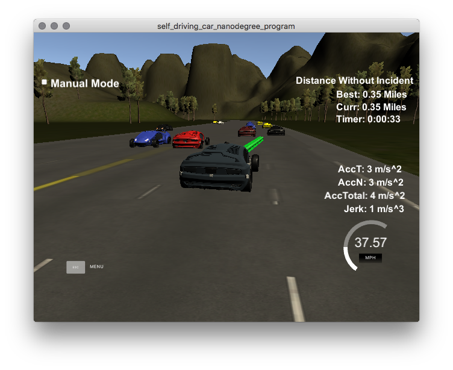

# Path Planning Simulation

Udacity [Self-Driving Car Engineer Nanodegree](https://www.udacity.com/course/self-driving-car-engineer-nanodegree--nd013)



[Click here](https://www.youtube.com/watch?v=34YczKN08eo&feature=youtu.be) for a video.

## Overview

This project simulates a virtual highway with numerous cars running at speeds +- 10 mph of a 50 mph speed limit. 

The goal of was to program the "ego" car to:
* Stay as close to the speed limit without exceeding it
* Drive inside the lane lines, except when changing lanes
* Avoid all collisions, including going too slow and being rear-ended
* Accelerate and decelerate smoothly within defined acceleration and jerk limits
* Change lanes safely when the leading car is moving slowly

The project comes with a list of waypoints around the highway. For all cars, localization and sensor fusion data are also provided.

The project must meet all points in the [rubric](https://review.udacity.com/#!/rubrics/1020/view). As shown in [the video](https://www.youtube.com/watch?v=34YczKN08eo&feature=youtu.be), this implementation can run at least 10 miles / 14 minutes without incident. 

## Install and Run

Refer to Udacity's [original README](./Udacity_README.md) for instructions on setting up the environment and execution.

## Implementation

Other than the addition of the header file [spline.h](./src/spline.h) from [this page](http://kluge.in-chemnitz.de/opensource/spline/), the rest of the implementation was completed in the file [main.cpp](./src/main.cpp). Udacity provided a number of helper functions in [main.cpp](./src/main.cpp). My implementation occurred in the telemetry section of the function h.onMessage(), between lines 233 and 445.

There are numerous ways to implement this project successfully. My implementation involves the use of [cubic splines](https://en.wikipedia.org/wiki/Spline_(mathematics)) to generate smooth trajectories. This is similar to an implementation provided in [Udacity's walk-through video](https://www.youtube.com/watch?v=7sI3VHFPP0w).

The implementation is divided into two categories:
1. Prediction and decision based on environmental cues
2. Generation of the vehicle's trajectory

### 1. Prediction and Decision

This step analyzes the localization and sensor fusion data for all cars on the same side of the track, including the ego vehicle. 

```cpp
// Lane identifiers for other cars
bool too_close = false;
bool car_left = false;
bool car_right = false;

// Find ref_v to use, see if car is in lane
for (int i = 0; i < sensor_fusion.size(); i++) {
    // Car is in my lane
    float d = sensor_fusion[i][6];

    // Identify the lane of the car in question
    int car_lane;
    if (d >= 0 && d < 4) {
        car_lane = 0;
    } else if (d >= 4 && d < 8) {
        car_lane = 1;
    } else if (d >= 8 && d <= 12) {
        car_lane = 2;
    } else {
        continue;
    }

    // Check width of lane, in case cars are merging into our lane
    double vx = sensor_fusion[i][3];
    double vy = sensor_fusion[i][4];
    double check_speed = sqrt(vx*vx + vy*vy);
    double check_car_s = sensor_fusion[i][5];

    // If using previous points can project an s value outwards in time
    // (What position we will be in in the future)
    // check s values greater than ours and s gap
    check_car_s += ((double)prev_size*0.02*check_speed);

    int gap = 30; // m

    // Identify whether the car is ahead, to the left, or to the right
    if (car_lane == lane) {
        // Another car is ahead
        too_close |= (check_car_s > car_s) && ((check_car_s - car_s) < gap);
    } else if (car_lane - lane == 1) {
        // Another car is to the right
        car_right |= ((car_s - gap) < check_car_s) && ((car_s + gap) > check_car_s);
    } else if (lane - car_lane == 1) {
        // Another car is to the left
        car_left |= ((car_s - gap) < check_car_s) && ((car_s + gap) > check_car_s);
    }
}
```

In lines 261 to 307 of [main.cpp](./src/main.cpp), the positions of all the other vehicles are analyzed relative to the ego vehicle. If the ego vehicle is within 30 meters of the vehicle in front, the boolean too_close is flagged true. If vehicles are within that margin on the left or right, car_left or car_right are flagged true, respectively.

```cpp
// Modulate the speed to avoid collisions. Change lanes if it is safe to do so (nobody to the side)
double acc = 0.224;
double max_speed = 49.5;
if (too_close) {
    // A car is ahead
    // Decide to shift lanes or slow down
    if (!car_right && lane < 2) {
        // No car to the right AND there is a right lane -> shift right
        lane++;
    } else if (!car_left && lane > 0) {
        // No car to the left AND there is a left lane -> shift left
        lane--;
    } else {
        // Nowhere to shift -> slow down
        ref_vel -= acc;
    }
} else {
    if (lane != 1) {
        // Not in the center lane. Check if it is safe to move back
        if ((lane == 2 && !car_left) || (lane == 0 && !car_right)) {
            // Move back to the center lane
            lane = 1;
        }
    }
    
    if (ref_vel < max_speed) {
        // No car ahead AND we are below the speed limit -> speed limit
        ref_vel += acc;
    }
}
```

In lines 309 to 338 of [main.cpp](./src/main.cpp), decisions are made on how to adjust speed and change lanes. If a car is ahead within the gap, the lanes to the left and right are checked. If one of them is empty, the car will change lanes. Otherwise it will slow down.

The car will move back to the center lane when it becomes clear. This is because a car can move both left and right from the center lane, and it is more likely to get stuck going slowly if on the far left or right.

If the area in front of the car is clear, no matter the lane, the car will speed up.

### 2. Trajectory Generation

Lines 340 to 445 of [main.cpp](./src/main.cpp) compute the trajectory of the vehicle from the decisions made above, the vehicle's position, and historical path points. 

```cpp
// Create a list of widely spaced (x,y) waypoints, evenly spaced at 30m
vector<double> ptsx;
vector<double> ptsy;

// Reference x, y, yaw states
double ref_x = car_x;
double ref_y = car_y;
double ref_yaw = deg2rad(car_yaw);

// If previous size is almost empty, use the car as starting reference
if (prev_size < 2) {
    // Use two points that make the path tangent to the car
    double prev_car_x = car_x - cos(car_yaw);
    double prev_car_y = car_y - sin(car_yaw);

    ptsx.push_back(prev_car_x);
    ptsx.push_back(car_x);

    ptsy.push_back(prev_car_y);
    ptsy.push_back(car_y);
} else {
    // Use the previous path's endpoint as starting ref
    // Redefine reference state as previous path end point

    // Last point
    ref_x = previous_path_x[prev_size-1];
    ref_y = previous_path_y[prev_size-1];

    // 2nd-to-last point
    double ref_x_prev = previous_path_x[prev_size-2];
    double ref_y_prev = previous_path_y[prev_size-2];
    ref_yaw = atan2(ref_y-ref_y_prev, ref_x-ref_x_prev);

    // Use two points that make the path tangent to the path's previous endpoint
    ptsx.push_back(ref_x_prev);
    ptsx.push_back(ref_x);

    ptsy.push_back(ref_y_prev);
    ptsy.push_back(ref_y);
}

// Using Frenet, add 30 m evenly spaced points ahead of the starting reference
vector<double> next_wp0 = getXY(car_s+30, (2+4*lane), map_waypoints_s, map_waypoints_x, map_waypoints_y);
vector<double> next_wp1 = getXY(car_s+60, (2+4*lane), map_waypoints_s, map_waypoints_x, map_waypoints_y);
vector<double> next_wp2 = getXY(car_s+90, (2+4*lane), map_waypoints_s, map_waypoints_x, map_waypoints_y);

ptsx.push_back(next_wp0[0]);
ptsx.push_back(next_wp1[0]);
ptsx.push_back(next_wp2[0]);

ptsy.push_back(next_wp0[1]);
ptsy.push_back(next_wp1[1]);
ptsy.push_back(next_wp2[1]);

for (int i = 0; i < ptsx.size(); i++) {
    // Shift car reference angle to 0 degrees
    double shift_x = ptsx[i] - ref_x;
    double shift_y = ptsy[i] - ref_y;

    ptsx[i] = (shift_x * cos(0-ref_yaw) - shift_y * sin(0-ref_yaw));
    ptsy[i] = (shift_x * sin(0-ref_yaw) + shift_y * cos(0-ref_yaw));
}
```

In lines 340 to 401 of [main.cpp](./src/main.cpp), the last two points in the already-covered terrain are computed. If the vehicle has not yet moved 60 meters, the vehicle's current position is used instead of the historical waypoints. In addition, the Frenet helper function getXY() is used to generate three points spaced evenly at 30 meters in front of the car

Because splines are the method used to generate the trajectory, a shift and rotate transform is applied.

```cpp
// Create a spline called s
tk::spline s;

// Set (x,y) points to the spline
s.set_points(ptsx, ptsy);

// Define the actual (x,y) points we will use for the planner
vector<double> next_x_vals;
vector<double> next_y_vals;

// Start with all the previous path points from last time
for (int i = 0; i < previous_path_x.size(); i++) {
    next_x_vals.push_back(previous_path_x[i]);
    next_y_vals.push_back(previous_path_y[i]);
}

// Compute how to break up spline points so we travel at our desired reference velocity
double target_x = 30.0;
double target_y = s(target_x);
double target_dist = sqrt((target_x) * (target_x) + (target_y) * (target_y));
double x_add_on = 0;

// Fill up the rest of the path planner to always output 50 points
for (int i = 1; i <= 50 - previous_path_x.size(); i++) {
    double N = (target_dist/(.02*ref_vel/2.24));
    double x_point = x_add_on + (target_x) / N;
    double y_point = s(x_point);

    x_add_on = x_point;

    double x_ref = x_point;
    double y_ref = y_point;

    // Rotate back to normal after rotating it earlier
    x_point = (x_ref * cos(ref_yaw) - y_ref*sin(ref_yaw));
    y_point = (x_ref * sin(ref_yaw) + y_ref*cos(ref_yaw));

    x_point += ref_x;
    y_point += ref_y;

    next_x_vals.push_back(x_point);
    next_y_vals.push_back(y_point);
}
```

In lines 403 to 445 of [main.cpp](./src/main.cpp), the computed waypoints are transformed using a spline. The spline makes it relatively easy to compute a smooth trajectory in 2D space while taking into account acceleration and velocity. 

50 waypoints are generated in total. Because the length of the generated trajectory is variable, after the vehicle has assumed the correct position, the rest of the waypoints are generated to keep the vehicle in the target lane. This can be observed by watching the green trajectory line in front of the vehicle as a lane change occurs ([in the video](https://www.youtube.com/watch?v=34YczKN08eo&feature=youtu.be)).